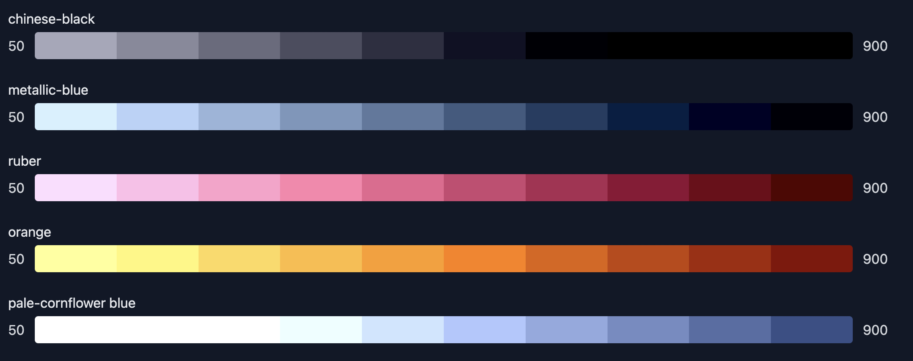

# Gearbox Brand Assets and Styling
This repo contains brand assets for Gearbox Protocol
Included are versions of the logo with and without text as well as other images that may be useful to internal or external parties for promoting Gearbox Protocol.

If you would like to remain consistent with Gearbox brand styling, we recommend you use the following colors and fonts:

Color palette gradients have been generated so that the -500 value corresponds to the value chosen by the design team.

A visual preview is as follows:



```json
{
  "colors": {
    "chinese-black": {
      "50": "#424356",
      "100": "#38394c",
      "200": "#2e2f42",
      "300": "#242538",
      "400": "#1a1b2e",
      "500": "#101124",
      "600": "#06071a",
      "700": "#000010",
      "800": "#000006",
      "900": "#000000"
    },
    "metallic-blue": {
      "50": "#718db2",
      "100": "#6783a8",
      "200": "#5d799e",
      "300": "#536f94",
      "400": "#49658a",
      "500": "#3f5b80",
      "600": "#355176",
      "700": "#2b476c",
      "800": "#213d62",
      "900": "#173358"
    },
    "ruber": {
      "50": "#fd79a3",
      "100": "#f36f99",
      "200": "#e9658f",
      "300": "#df5b85",
      "400": "#d5517b",
      "500": "#cb4771",
      "600": "#c13d67",
      "700": "#b7335d",
      "800": "#ad2953",
      "900": "#a31f49"
    },
    "orange": {
      "50": "#ffb132",
      "100": "#ffa728",
      "200": "#ff9d1e",
      "300": "#ff9314",
      "400": "#ff890a",
      "500": "#ff7f00",
      "600": "#f57500",
      "700": "#eb6b00",
      "800": "#e16100",
      "900": "#d75700"
    },
    "pale-cornflower blue": {
      "50": "#e1faff",
      "100": "#d7f0ff",
      "200": "#cde6ff",
      "300": "#c3dcff",
      "400": "#b9d2ff",
      "500": "#afc8ff",
      "600": "#a5bef5",
      "700": "#9bb4eb",
      "800": "#91aae1",
      "900": "#87a0d7"
    }
  }
}
```

Fonts:

Rubik
