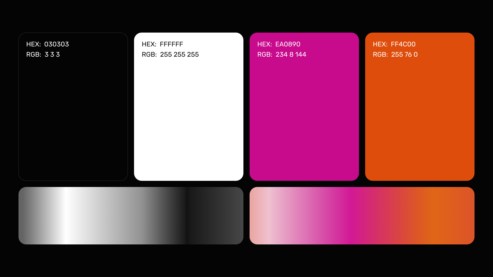

# Gearbox Brand Assets and Styling
This repo contains brand assets for Gearbox Protocol
Included are versions of the logo with and without text as well as other images that may be useful to internal or external parties for promoting Gearbox Protocol.

If you would like to remain consistent with Gearbox brand styling, we recommend you use the following colors and fonts:

### Fonts: 

Rubik

### Important information for contributors
As a contributor to the Gearbox Protocol GitHub repository, your pull requests indicate acceptance of our Gearbox Contribution Agreement. This agreement outlines that you assign the Intellectual Property Rights of your contributions to the Gearbox Foundation. This helps safeguard the Gearbox protocol and ensure the accumulation of its intellectual property. Contributions become part of the repository and may be used for various purposes, including commercial. As recognition for your expertise and work, you receive the opportunity to participate in the protocol's development and the potential to see your work integrated within it. The full Gearbox Contribution Agreement is accessible within the [repository](/ContributionAgreement) for comprehensive understanding. [Let's innovate together!]
